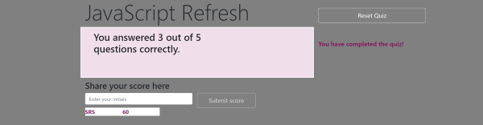

# JavaScript Quiz
This is an application that utilizes JavaScript tools to create an interactive quiz designed for student use.

## You will find in this application:
* Dynamically updated questions powered by JavaScript
* Answers are checked immediately and results alerted
* Timer element that stops quiz when out of time, and decrements when wrong answer selected. 
* a polished interface and mobile responsiveness.

## Resources
* W3 School
* StackOverflow
* MDN
* Codemahal @ https://www.codemahal.com/video/javascript-quiz-tutorial/

## Links
* URL: https://shaylastevenson.github.io/javascript-quiz/
* Github repo: https://github.com/ShaylaStevenson/javascript-quiz
